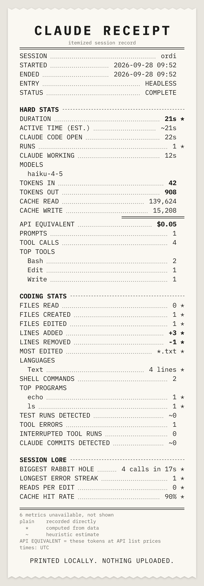

# Claude Receipt

> Every Claude Code session, itemized.

Claude Receipt is a local-first tool that turns a Claude Code session into a receipt: the hard numbers (time, models, tokens, API-equivalent cost), the coding work (files, lines, commands, tests, commits) and a bit of session lore (the biggest rabbit hole, the peak hour, what kind of session it was).

The long-term goal is "Spotify Wrapped for Claude Code": session receipts, weekly and monthly summaries, and a yearly Claude Wrapped. All of it is computed on your machine from the data Claude Code already writes locally.

```
/\/\/\/\/\/\/\/\/\/\/\/\/\/\/\/\/\/\/\/\

      C L A U D E   R E C E I P T
        itemized session record
========================================
SESSION ..................... ordinary
PROJECT ...................... project
STATUS ...................... COMPLETE

-- HARD STATS --------------------------
DURATION ......................... 21s *
ACTIVE TIME (EST.) .............. ~21s
TOKENS OUT ....................... 908
API EQUIVALENT ................. $0.05

-- CODING STATS ------------------------
LINES ADDED ....................... +3 *
TEST RUNS DETECTED ................ ~0

-- SESSION LORE ------------------------
BIGGEST RABBIT HOLE ... 4 calls in 17s *
CACHE HIT RATE ................... 90% *
========================================
plain    recorded directly
  *      computed from data
  ~      heuristic estimate
```

*Excerpt of a receipt rendered from an anonymized test fixture (full version: `test/render/snapshots/ordinary.txt`).*

## Status

**v0.1.0, pre-release.** It parses Claude Code's local session files, computes a Receipt, keeps a local metrics-only archive, prints a terminal receipt, and exports the receipt as a PNG or SVG image. The package is built and tested but **not yet published to npm**. Weekly/monthly summaries and Wrapped come later ([roadmap](docs/ROADMAP.md)).

## Install

Requires **Node 24 or newer**.

```
npm install -g claude-receipt     # once published
npx claude-receipt                # or run it without installing
```

Until the first npm release, install from a checkout:

```
git clone <this repository> && cd claude-receipt
npm install                       # also builds dist/ (the compiled CLI)
npm install -g .                  # or: npm pack, then npm install -g ./claude-receipt-0.1.0.tgz
```

The package contains the compiled JavaScript, the two bundled font files and the licences. Its one runtime dependency is `@resvg/resvg-wasm` (WebAssembly, no native code), which turns the receipt SVG into a PNG.

## Usage

```
claude-receipt                    # receipt for the current or most recent session in this directory
claude-receipt last               # most recent completed session anywhere
claude-receipt list               # recent sessions, newest first (--limit N)
claude-receipt <session-prefix>   # a specific session
claude-receipt last --json        # the Receipt as JSON (a versioned contract for scripts)
claude-receipt last --redact      # terminal receipt with project, paths and title hidden
claude-receipt export             # a shareable PNG of the receipt (redacted)
```

**Reading a receipt.** Plain values were recorded by Claude Code, values ending in `*` were computed from recorded data, and values starting with `~` are heuristic estimates (their labels say so too, such as `ACTIVE TIME (EST.)`). Metrics that can't be determined are left out and counted (`N metrics unavailable, not shown`), never shown as zero. **API EQUIVALENT** is what the session's tokens would cost at Anthropic's API list prices: Claude Code's own recorded cost when it has one, otherwise computed from a price table that ships with the package. It is an equivalent, not a charge or a bill.

**The archive.** Every run first sweeps Claude Code's local sessions and saves each finished one to `~/.claude-receipt/archive/`: the computed metrics plus the session header (session id, project name and directory, times, Claude Code version) and the most-edited file path, but no prompts, responses, code, tool output, commands or session titles. Receipts survive Claude Code's transcript cleanup. Live sessions are not archived. `--no-archive` makes a run read-only.

### Shareable image

```
claude-receipt export                          # PNG of the current/most recent session, redacted
claude-receipt export last --svg               # the canonical SVG instead
claude-receipt export <session-prefix> -o my-receipt.png
claude-receipt export --no-redact              # keep project, title and file names
```



*A redacted export of an anonymized test fixture (`docs/receipt-sample.png`, regenerated by the test suite).*

- The default is a **PNG at 2× (1248 px wide)**, rendered from the same SVG that `--svg` writes. Session choice is the same as for the terminal receipt (`last`, a prefix, or the current directory's latest session; a live session is exported as a snapshot marked LIVE).
- **Redacted by default:** no project name, paths, session title or file names (the most-edited file shows only its extension), and the session id is cut to 4 characters. `--no-redact` is the only opt-out. No image ever contains prompts, responses, commands or other conversation text, and PNGs carry no metadata.
- The file goes to `./claude-receipt-<id>.png` (`-2`, `-3`, … if that exists) or to `--output <file>`. **Existing files are never overwritten**: an existing `--output` path makes the export fail. The path is printed on stdout.
- **Text coverage:** images use the bundled IBM Plex Mono: Latin (including accented Western and Central European letters), Cyrillic and common punctuation. Other scripts (Chinese, Japanese, Korean, Greek, Arabic, Hebrew, Devanagari) and emoji show as empty boxes in the PNG; the layout stays intact. In the SVG, a viewer may substitute its own font for those characters.

## Configuration

| Variable | Default | Effect |
|---|---|---|
| `CLAUDE_RECEIPT_HOME` | `~/.claude-receipt` | Where the archive lives (`$CLAUDE_RECEIPT_HOME/archive/`) |
| `CLAUDE_CONFIG_DIR` | `~/.claude` | Where Claude Code's data is read from (the same variable Claude Code uses) |
| `NO_COLOR` | unset | Plain terminal output without bold/dim |

## Privacy

- Everything runs on your machine. Claude Receipt makes **no network requests** and has no account, telemetry or upload of any kind.
- It reads Claude Code's session files under `~/.claude/` (`projects/`, plus `sessions/` to tell which sessions are still running) read-only. It never reads credentials and never modifies Claude Code's files.
- Default metrics come from metadata (timestamps, token counts, tool names, file paths), not from what you or Claude wrote. The archive holds those metrics and the session header described above, never conversation text.
- The terminal receipt shows project and file names because it stays on your screen; `export` (and `--redact`) hide them. Treat `--no-redact` exports and `--json` output as private.

Details: [docs/PRIVACY.md](docs/PRIVACY.md).

## Limitations

- It reads Claude Code's local session files, whose format is undocumented. It is tested against fixtures from Claude Code 2.1.283 and tolerates unknown records, but a format change can make metrics unavailable until it is updated.
- Receipts exist only for sessions still on disk or already archived. Sessions that Claude Code cleaned up before Claude Receipt first ran cannot be recovered.
- Heuristic metrics (marked `~`, such as active time, detected test runs and Claude-authored commits) are estimates, not records.
- Images cover only the glyphs of the bundled IBM Plex Mono (see above).
- v0.1.0 has been tested on Windows; macOS and Linux have not been verified yet.

## Principles

- **Local-first.** Nothing is uploaded anywhere. No account and no network access are needed to produce a receipt.
- **Honest numbers.** Every metric is tagged `exact`, `derived` or `heuristic`, and estimates are never presented as facts. API-equivalent cost is never called "money spent".
- **Private by default.** Default analytics use metadata (timestamps, token counts, tool names, file paths), not what you or Claude wrote. Features that need conversation text are opt-in.
- **A story, not a dashboard.** Useful engineering stats plus playful session lore, printed like a real thermal receipt.

## Documentation

| Doc | Contents |
|---|---|
| [docs/PRD.md](docs/PRD.md) | Product, user experience, MVP and future direction |
| [docs/ARCHITECTURE.md](docs/ARCHITECTURE.md) | Modules, data flow, Session, Receipt and archive models |
| [docs/METRICS.md](docs/METRICS.md) | The metric registry: every metric, its source and provenance |
| [docs/PRIVACY.md](docs/PRIVACY.md) | What is read, what is never stored, export redaction |
| [docs/ROADMAP.md](docs/ROADMAP.md) | Milestones and acceptance criteria |

## Licence

Claude Receipt is MIT-licensed ([LICENSE](LICENSE)). Bundled and dependent components keep their own licences: IBM Plex Mono is under the SIL Open Font License 1.1 ([assets/fonts/IBMPlexMono-LICENSE.txt](assets/fonts/IBMPlexMono-LICENSE.txt); Reserved Font Name "Plex"), and `@resvg/resvg-wasm` is under the Mozilla Public License 2.0.

## Disclaimer

Claude Receipt is an independent project and is not affiliated with Anthropic. It reads Claude Code's local session files, whose format is undocumented and may change.
